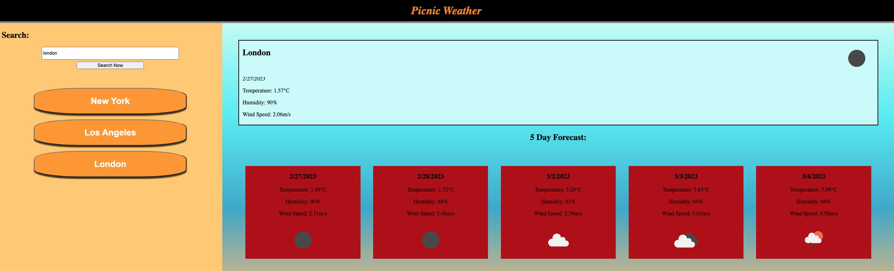

# PicnicWeather

### Description
This repo is for the UCLA fullstack program bootcamp, module 6. 
This program helps users plan thier travel based on weather conditions 
Searching a city allows the weather API to fetch relevant weather data, both current conditions and a 5 day forecast 
Every search is saved in the side bar so users can easily jump between the various cities they plan to travel and see the local conditions 
The module 6 assignment provides the following as a guideline and criteria for the assignment:

### User Story 
AS A traveler 
I WANT to see the weather outlook for multiple cities 
SO THAT I can plan a trip accordingly 

### Acceptance Criteria 
GIVEN a weather dashboard with form inputs 
WHEN I search for a city 
THEN I am presented with current and future conditions for that city and that city is added to the search history 
WHEN I view current weather conditions for that city 
THEN I am presented with the city name, the date, an icon representation of weather conditions, the temperature, the humidity, and the the wind speed 
WHEN I view future weather conditions for that city 
THEN I am presented with a 5-day forecast that displays the date, an icon representation of weather conditions, the temperature, the wind speed, and the humidity 
WHEN I click on a city in the search history 
THEN I am again presented with current and future conditions for that city 

### Links

Deployed Application:

### Screenshot

### Contact

Github: VulnusR 
Gmail: Caleb.lockwood626@gmail.com, Vulnus.Regium@gmail.com